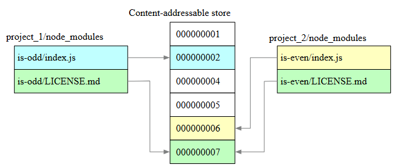

## The Problem with a Naive Centralized Package Directory

A seemingly straightforward solution to avoid duplicating `node_modules`
across multiple projects would be to create a single central directory
containing all required packages, leveraging Node.js's recursive module
resolution algorithm to locate them from any project on the filesystem.

However, npm was never designed to solve this problem. Its architecture
follows the Unix design principle of doing one thing well: resolving and
installing packages into a local `node_modules` directory per project.
Repurposing npm's resolution algorithm for centralized storage would work
against its core design, introducing fragility and unexpected behavior
across projects that share dependencies at different versions.

## pnpm's Solution: Hard Links and Content-Addressable Storage

pnpm solves the duplication problem through two core mechanisms:
**hard links** and a **content-addressable store**.

A hard link is an alternative path that points directly to the same
physical content on disk as the original file. Unlike a copy, no new
data is written — multiple paths reference the same underlying bytes.

The **content-addressable store** is a central disk location where pnpm
stores the physical files of every installed package, identified by their
content rather than their name or location. From the project's perspective,
the workflow is identical to `npm`: `pnpm` generates a `package.json` and a
`node_modules/` directory. What differs is what lives inside `node_modules/`
— instead of file copies, pnpm creates hard links pointing to the store.

This eliminates disk duplication across projects: when multiple projects
depend on the same package, pnpm creates independent hard links in each
project's `node_modules/`, all pointing to the same physical content in
the store. No data is duplicated — only the references multiply.

The same principle applies across package versions. When a project upgrades
a dependency, pnpm adds only the files that changed between versions to the
store. The files that remain identical across versions already exist in the
store and are reused via hard links — no redundant storage for unchanged content.

---



> This can be observed in the image: two projects with different packages
> (`is-odd` and `is-even`) share entries in the store because some of their
> files have identical content. pnpm does not duplicate those files — both
> projects point to the same store slot via hard links.

---

## Installation Speed: pnpm's Three-Stage Pipeline

When you run `pnpm install`, pnpm breaks the work into three distinct stages:

**Stage 1 — Dependency Resolution:** pnpm reads `pnpm-lock.yaml` and resolves
the full dependency tree: both the direct dependencies declared in your
`package.json` and the transitive dependencies those packages require.
By the end of this stage, pnpm has a complete and exact list of everything
that needs to be fetched.

**Stage 2 — Directory Structure Calculation:** pnpm calculates exactly how
`node_modules/` should be structured — the folder hierarchy and hard link
layout — before writing anything to disk. This is the planning stage:
no files are created or modified yet.

**Stage 3 — Linking:** pnpm executes the installation by creating the
calculated `node_modules/` structure and establishing hard links between
it and the store. Packages that already exist in the store from previous
installations are not downloaded again — they are linked directly.

![Package Installation Progress] (./pnpm-package-installation-progress.png)

> pnpm treats each package independently. As soon as an individual package
> completes Stage 1 (Resolution), it immediately moves to Stage 2 (Fetching),
> without waiting for the remaining packages to finish resolving. As a result,
> at any given point in time, some packages are being resolved, others are
> being fetched, and others are being linked — all simultaneously.

---

## Non-flat `node_modules` Structure

### The Problem: Phantom Dependencies

Part of the problem that motivated pnpm's solution is a side effect
introduced by npm known as **phantom dependencies**.

When you install a direct dependency that requires other packages to
function — for example, `express`, which internally requires `cookie` —
npm installs `cookie` as well. However, npm places it at the root of
`node_modules/`, at the same level as your direct dependencies:

```
node_modules/
  express/        ← your direct dependency
  cookie/         ← indirect dependency (required by express, not by you)
  other-stuff/    ← more indirect dependencies
```

This is known as **flat `node_modules`**: a flat structure where all
packages coexist at the root with no hierarchy reflecting who depends
on whom.

> **Phantom Dependency:** As a result, your project's source code can
> accidentally import those indirect dependencies. If the direct dependency
> changes — a version update, a refactor, or a dropped sub-dependency —
> the indirect package may disappear from `node_modules/` without warning,
> breaking your code silently. This is what the industry calls a
> **phantom dependency**.

This happens because of how Node.js resolves modules. When your source
code imports a package, Node.js starts from the directory of the current
file and walks up the directory tree level by level, searching for a
`node_modules/` folder containing the requested package. With npm's flat
structure, `cookie` sits at the root and Node.js finds it — regardless
of whether you declared it as a dependency.

### How pnpm Solves Phantom Dependencies: Symlinks

pnpm resolves phantom dependencies by controlling exactly what is visible
at the root of `node_modules/`.

**At the root of `node_modules/`:** pnpm places only symlinks for your
**direct dependencies** — the packages you explicitly declared in your
`package.json`. `express` appears there because you declared it. `cookie`
does not appear because you did not.

**Inside `.pnpm/`:** this is where the real directory structure lives.
Every package has its own folder at the root of `.pnpm/`, named with its
exact version. Inside each package folder, pnpm creates a `node_modules/`
directory containing symlinks to that package's own dependencies — pointing
to their respective folders at the root of `.pnpm/`. For example, `cookie`
lives inside `express@4.17.3/node_modules/` as a symlink pointing to
`cookie@0.4.2/` at the root of `.pnpm/`.

```
node_modules/
  express/                          ← symlink (your direct dependency)
  .pnpm/
    express@4.17.3/
      node_modules/
        express/                    ← hard link → content-addressable store
        cookie/                     ← symlink → .pnpm/cookie@0.4.2/node_modules/cookie
    cookie@0.4.2/
      node_modules/
        cookie/                     ← hard link → content-addressable store
```

> **Phantom dependencies eliminated:** your source code can only import
> what you explicitly declared in `package.json` — because only those
> packages are exposed at the root of `node_modules/`.

> **Why does `node_modules/` exist inside each package folder in `.pnpm/`?**
>
> This structure is a direct consequence of how Node.js resolves modules.
> When your source code imports a package, Node.js starts from the current
> file's directory and walks up the directory tree, looking for a
> `node_modules/` folder containing the requested package.
>
> When Node.js encounters the symlink at the root of `node_modules/`, it
> resolves it to its real location inside `.pnpm/<package@version>/node_modules/<package>/`,
> ignoring the fact that it traversed a symlink. From that resolved location,
> Node.js continues its upward search for the package's own dependencies —
> and finds them in the adjacent `node_modules/` folder that pnpm placed there.
>
> This is why `node_modules/` exists inside each package folder in `.pnpm/`:
> it is not a structural coincidence — it is a deliberate decision to align
> with Node.js's module resolution algorithm. The `node_modules/` folder is
> a resolution anchor for Node.js, and pnpm places it precisely where
> Node.js expects to find it.

---

### Hoisting Fallback: Compatibility with Broken Packages

pnpm eliminated phantom dependencies by installing indirect dependencies
as symlinks inside the directories of the packages that require them.
But what happens with packages that use indirect dependencies not declared
in their own `package.json`? These are known in the industry as
**broken packages**.

When Node.js executes a broken package's `index.js` and encounters an
`import` or `require` for an undeclared dependency, it walks up the
directory tree searching for it. Without any fallback mechanism, Node.js
would not find it inside `.pnpm/<broken-package@version>/node_modules/`
— because pnpm never placed it there, since it was never declared.

To maintain compatibility with the broader npm ecosystem, pnpm implements
what the industry calls **hoisting fallback**: pnpm creates symlinks in
`.pnpm/node_modules/` for all indirect dependencies that already exist
in `.pnpm/` because at least one package declared them. This acts as a
safety net — broken packages can find their undeclared dependencies there
when Node.js walks up the directory tree past their own `node_modules/`.

```
.pnpm/
  node_modules/                     ← hoisting fallback layer
    cookie/                         ← symlink → .pnpm/cookie@0.4.2/node_modules/cookie

  express@4.17.3/
    node_modules/
      express/                      ← hard link → store
      cookie/                       ← symlink → .pnpm/cookie@0.4.2/node_modules/cookie

  cookie@0.4.2/
    node_modules/
      cookie/                       ← hard link → store
```

Your source code remains protected: Node.js walks up from your project's
`src/` directory, reaches `node_modules/` at the project root, and only
finds symlinks for your declared dependencies. It never reaches
`.pnpm/node_modules/` from that path — that layer is only accessible
from within `.pnpm/` itself.
